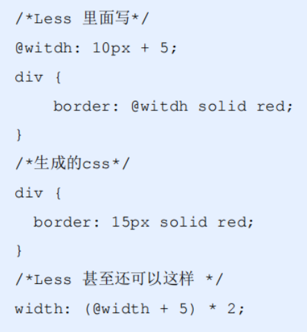

<!-- 01 -->
## 行内元素
span,a ( ::before 伪元素(content:"") 默认是行内元素 )
不能设置宽高 一行内显示 默认宽度是内容宽度 margin值只左右有效

## 行内块元素
img input td
可设置宽高 一行显示 默认内容宽度 排列有缝隙 挤压会换行
## 块元素

固定定位是以屏幕为标准 和父级没有关系

## less基础
css预处理器
引入了变量，Mixin(混入)，运算，函数功能

### 变量
@color: pink;
使用 color: @color;

### 嵌套
如果有&符号，就被解析为父元素自身或父元素的伪类

### 运算

任何数字、颜色或者变量都可以参与运算。就是Less提供了加（+）、减（-）、乘（*）、除（/）算术运算
