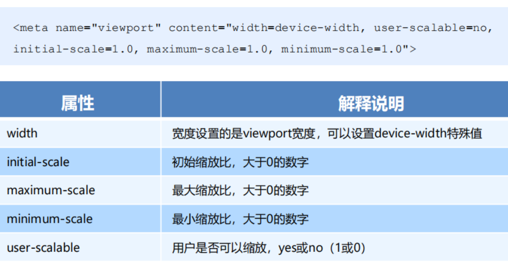
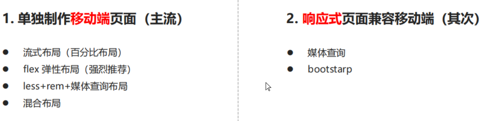
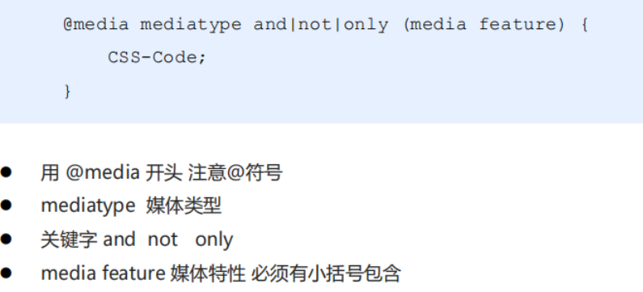
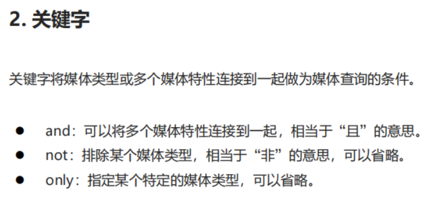
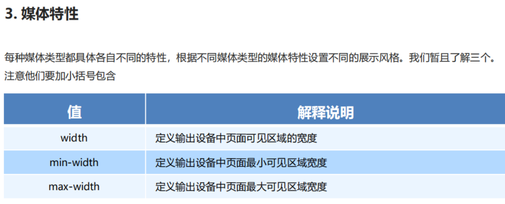
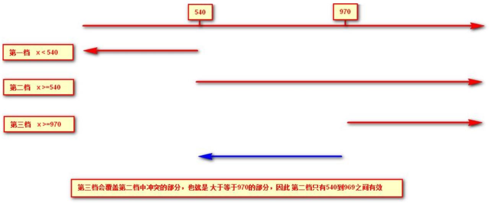
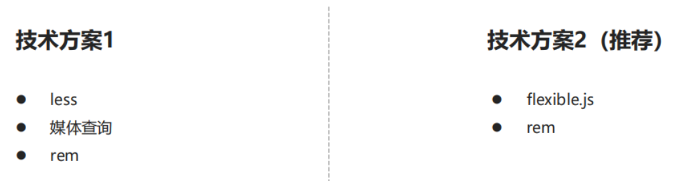
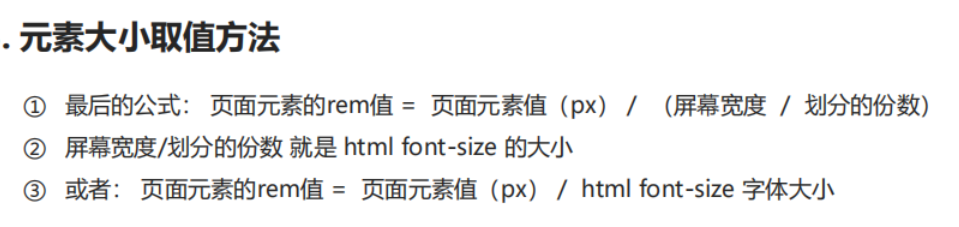
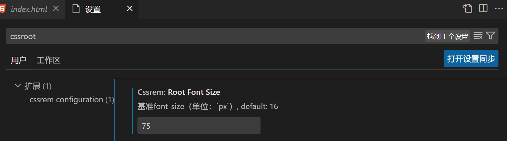
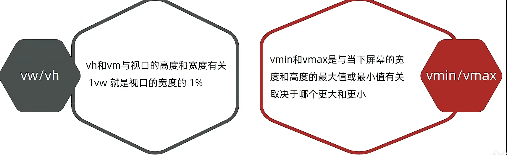

<!-- 01 -->
# 1.流式布局
## 视口
浏览器显示页面内容的屏幕区域
布局视口：
  PC上的网页大多都能在手机上呈现，只不过元素看上去很小，一般默认可以通过手动缩放网页
视觉视口
理想视口：使网站在移动端有最理想的浏览和阅读宽度而设定,需要手动添写meta视口标签,布局视口和理想视口的宽度保存一致


## 二倍图
物理像素：屏幕显示的最小颗粒
物理像素比：1个px能显示的物理像素点的个数
什么时候使用二倍图：
比如放在iphone8里面图片会放大2倍，会模糊，我们采用 放一个2倍图，设置样式缩小为 原来尺寸大小  这样解决了模糊问题
## 移动端技术解决方案
单独制作移动端页面 和 响应式页面
## 移动端常见布局

## 流式布局(百分比布局)
最大小宽度：min-width,max-width

使用流式布局做移动端页面，我们首先设置好body样式（一般要有 margin: 0 auto,min-width,max-width)
然后使用流式布局（一般和 :nth-child(n){}  搭配 width: % 或者 float:left 搭配 width: %

## flex布局
```
//将主轴设置成y轴
flex-direction: column
//设置主轴上子元素的排列方式
justify-content: center | flex-start | flex-end | space-around | space-between
//设置侧轴上子元素的排列方式
align-items: center
//单独设置侧轴上子元素的排列方式
align-self: flex-end
//子元素是否换行 默认不换行
flex-wrap: wrap
//设置侧轴对齐方式（多行）
align-content: center | flex-start | ...
//flex子项份数
flex:1
//定义项目的排列顺序(数值越小越靠前)
order: -1

```
<!-- 02 -->
## rem适配布局
优点：
页面布局文字能随着屏幕大小变化而变化
屏幕变化时 元素高度和宽度等比例缩放
流式布局和flex布局主要针对于宽度布局，而rem适配可以实现高度适配

em: 相对于父元素字体大小 font-size: 12px;
rem:相对于html元素字体大小，优势：整个页面只有一个html，很好控制整个页面的元素大小

## 媒体查询
优点：根据不同的屏幕尺寸在改变不同的样式



一般从小到大写


## rem + 媒体查询
使用媒体查询根据不同设备按比例设置html的字体大小，然后页面元素使用rem做尺寸单位，当html字体大小变化元素尺寸,也会发生变化，从而达到等比缩放的适配

实际开发适配方案：
如果设计稿是750px,假设我们将整个屏幕划分为15等份，每份作为html字体大小，是50px。里面页面元素rem值：页面元素的px值/50


使用flexible.js要注意：它是把当前设备划分成十等分
将vscode默认字体大小修改


## vw / vh
相对于视口的尺寸大小
将视口分为100份，1vw占一份
1vw = 1/100 视口宽度
1vh = 1/100 视口高度

开发中，会不会vw和vh混用吗？
不会，混用会导致盒子变形

### vmin
在哔哩哔哩上使用vmin，可以解决什么问题？
可以照顾手机端横屏和竖屏显示效果，当竖屏时，宽度小于高度时，以宽度进行布局。当是横屏时，高度小于宽度时，以高度进行布局。


vw和百分比有什么区别？
vw是相当于视口来说，而百分比是相对于父盒子来说的