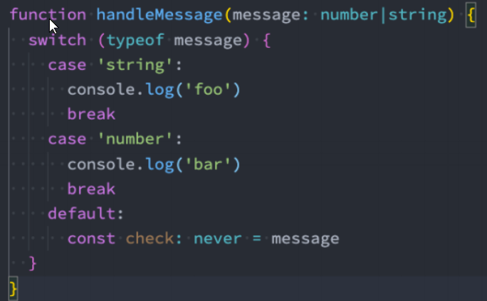
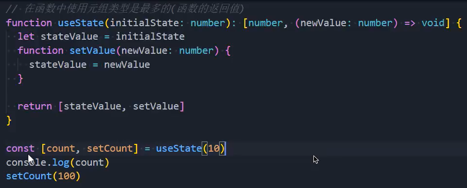

## 一. 邂逅TypeScript
* 下载typeScript: npm install -g typescript 
* 检测ts版本： tsc --version
* 进行ts编译： tsc .\xx.ts

可以直接
ts-node .\TS03.ts 进行编译

### 1.1. JavaScript的缺陷

* 类型缺失: 对于标识符是没有任何的类型校验, 有安全隐患.

* ECMAScript自己推出类型校验 => TS淘汰 => 类型思维肯定都是一致的

### 1.2. TypeScript类型校验

* flow
* TypeScript

### 1.3. TypeScript的特点

* 始于JavaScript, 归于JavaScript
* 类型校验, 适合开发大型项目
* 拥有JavaScript最新的特性

### 1.4. 前端学不动系列

## 二. TypeScript的语法

### 2.1. 定义变量的方式

* 类型注解 
* var/let/const 标识符： 数据类型 = 赋值;

* 类型推导

### 2.2. JavaScript中的数据类型

* number/Number
* 不区分整数类型(int)和浮点型(double),TS支持二进制，八，十六进制的表示
* string/String
* 同时也支持模板字符串来拼接变量和字符串
* boolean
* 数组类型
  * any[]
  * Array<any>
* 对象类型
  * object
  * { name: string, age: number }
* 函数类型
* symbol
* null/undefined

### 2.3. JavaScript中类型练习

* 函数的参数类型： 可以在每个参数后面加类型注解
* 函数的返回值类型
* 解析歌词的工具函数: 添加类型
* 对象类型
  * 可选属性 ?

### 2.4. TypeScript特有的类型

* any
不限制标识符的任意类型
使用场景： 1.请求来的数据过于繁琐，不希望加类型注解
* unknown

* void
  * 定义函数的类型时, 会使用
* never类型
永远不会发生值的类型
  * 自动推导
  * 封装框架/工具: 校验
  在封装框架、工具库的时候可以使用never,对于一些没有处理的case,可以直接报错
  
  * 类型工具: never(了解)
* tuple类型(元组类型)
  * 介于数组和对象之间类型
  数组中通常建议存放相同类型的元素，不同类型的元素是不推荐放在数组中
  * useState封装

## 三. TypeScript语法细节

### 3.1. 联合类型

* string | number
