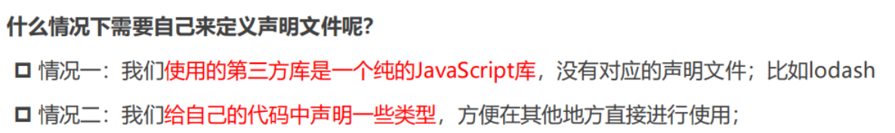

## 一. TypeScript内容扩展

### 1.1. 模块和命名空间

使用的模块化方案是ES Module

### 1.2. 声明文件的使用
xxx.d.ts文件，是类型声明文件

typescript会在哪里查找我们的类型声明呢？
1. 内置类型声明
2. 外部定义类型声明-第三方库

3. 自己定义类型声明

声明模块的语法: declare module '模块名' {}。
 在声明模块的内部，我们可以通过 export 导出对应库的类、函数等

### 1.3. tsconfig配置文件

## 二. axios的二次封装

### 2.1. 基本封装

### 3.2. 拦截器封装

### 3.3. 返回值类型泛型处理

## 三. 类型工具和体操

### 3.1. 条件类型

* 使用
* as
* infer
* 分发

### 3.2. 类型工具的使用

### 3.3. 类型工具的实现

