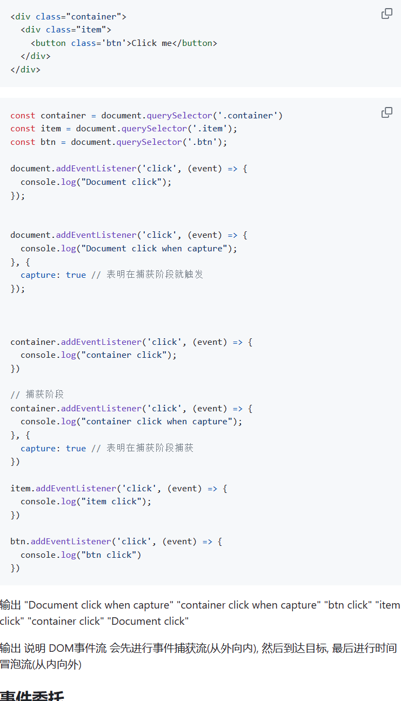

## 项目背景
## mock.js模拟手机号
开发时，后端还没完成数据输出，前端只好写静态模拟数据
## 按钮点击多次发送多个请求怎么处理 
请求发送完，才可以点击按钮
## http 401
发请求时，token没有传递或者过期
## 如何判断数据类型

<!-- 8.22 -->
# css
## 盒模型
box-sizing: content-box 
box-sizing: border-box 
## css 权重
id > class,属性选择器  > 标签
内联样式 !important 更高权重
## z-index 
值大 层叠靠上
## 水平垂直居中
flex / absolue(left/top 50%)|translate(-50%)
## 左侧固定、右侧自适应
flex:1
## 有哪些伪类和伪元素选择器
1.：hover | :nth-child | :first-child | :disabled(🈲选)
2.::before | ::after
## 有哪些选择器
id | class | 属性 | 伪类 | 伪元素 | 元素 | 通用*
后代 A B | 兄弟 A ~ B | 子代 A > B | 
## 什么是媒体查询
根据不同的屏幕尺寸在改变不同的样式
## rem em vw vh
根元素html的 font-size | 自身 | 视口宽度 | 视口高度
## BFC
display:flex | position: absolue | float: left/right | overflow: hidden(溢出隐藏|清除浮动|解决外边距塌陷) | 浮动元素算入高度 | 解决外边距重叠 | 解决高度塌陷（识别浮动，清除浮动）
https://segmentfault.com/a/1190000013647777
https://blog.csdn.net/qq_41638795/article/details/83304388
## position
static | relative | absolue | fixed(脱离文档流，以视口为参照) | sticky

<!-- end -->
<!-- 8.23 -->
<!-- DOM -->
## 跨域
协议 域名 端口号 | cors(设置响应头) | 代理 | jsonp(只能处理GET script.src标签)
## sessionStorage localStorage
## cookie
存储在用户浏览器上的小文本
## addEventListener()
## 事件冒泡 事件捕获 DOM事件流
冒泡： 不断向上传递给document
捕获： 相反
DOM事件流：三个阶段 事件捕获 到达目标 事件冒泡

## 事件委托
如果很多元素需要写事件监听，那么可以给所有元素的共同父元素添加一个事件处理程序，然后因为事件冒泡流的存在，在子元素上触发的事件最终会传递给父元素，所以在父元素上也可以监听到子元素上触发的事件，从而提升页面效率
减少整个页面所需要的内存，提升整体性能
<!-- JavaScript API -->
## 基本数据类型
七种： number | string | bigint | boolean | null | undefind | symbol
## Number | String | Array | Object | Promise API
Number: toFixed(定义小数)

String:  charAt(访问单个字符) | toUpperCase | toLowerCase | concat | match(/[A-Z]/g)(与正则表达式进行匹配) | trim(删除开头结尾空格) | slice(截取字符串一部分)

Array: push | shift | unshift | indexof | includes | filter | reverse | sort | split | reduce(回调函数两个参数：上次调用callbackFn的结果，当前值) | isArray | flat | concat | forEach(原数组执行方法) | map(会创建一个新数组) | join(转换字符串)

Object : defineProperty | keys | values | assign(浅拷贝) 

Promise: then | catch | fifily | all | race | any

## Math随机生成
Math.floor(Math.random() * length)

https://developer.mozilla.org/zh-CN/docs/Web/JavaScript/Reference/Global_Objects/String

## 类数组转换为数组
Array.from

## 如何判断某个值是数组
Array.isArray

## 防抖和节流
防抖：频繁点击只触发一次 input输入
节流：间隔一段时间只执行一次 

## typeof instanceof区别
typeof 基本数据类型 除null
instanceof 复杂数据类型

## bind call apply 的区别

